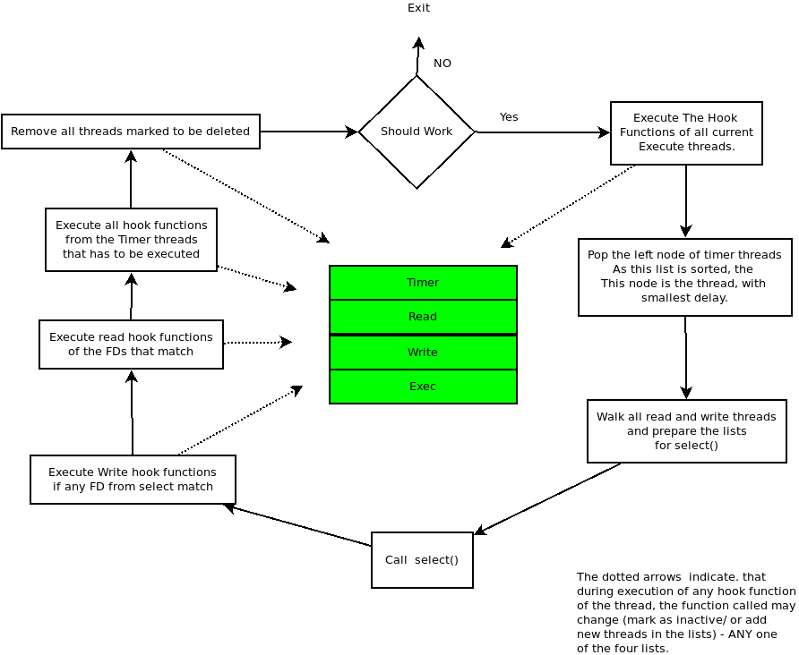
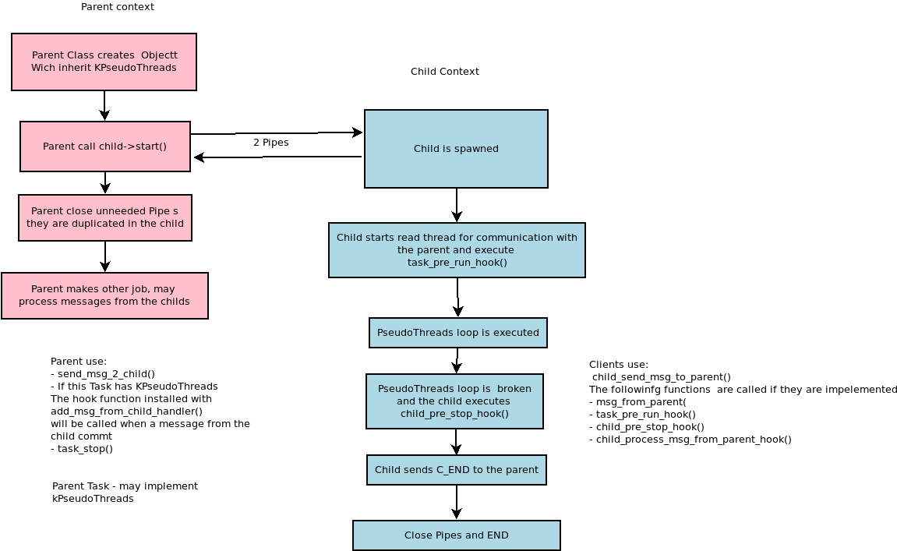

# KPseudoThreads
## Overview
This module provides a framework for writing Python applications with pseudo threads. These threads
never work in parallel, that's why no synchronization between them is needed. This makes implementing event based applications easier. 
Example:

    from kpseudothreads import KPseudoThreads 
    
    class SimpleTimerClass(KPseudoThreads):
        def __init__(self):
            KPseudoThreads.__init__(self, "Thread")
        def timer_fire(self, thr, arg):
            print("Thread Fired")

    something = SimpleTimerClass()
    something.add_timer_thread("Timer_1", 2000, something.timer_fire, None)
Or starting pseudo threads inside real threads

    from kpseudothreads import MyTask 
    import os
    import time
    class Something(MyTask):
        def __init__(self):
            MyTask.__init__(self)
        
        def task_pre_run_hook(self):
            self.add_timer_thread("Timer_1", 2000, self.timer_1_fire, None)
    
        def timer_1_fire(self, thr, arg):
            print("Child is working")
    
    
    something = Something()
    something.start()
    while True:
        print ("Parent sleeps tonight")
        time.sleep(1)

 We can see here that there are 2 processes started  
 
    $ ps afx | grep example
      21638 pts/0    S+     0:00  |   \_ python3 ./example4.py
      21639 pts/0    S+     0:00  |       \_ python3 ./example4.py

It is released under a free software license, see LICENSE for more details.

Copyright (C) 2022 Kaloyan Stoilov <stoilov.kaloyan (at) gmail . com>
https://github.com/kboko/KPseudoThreads.git

## Requirements

Works on python 2 and 3

## Installation

ToDo

## Short introduction

The core of this framework is waiting for events on a select() syscall. The user register its own function hooks, that are called when an event occur. During this time the process is in inactive state. If any event occur the select() exits
and process the events - this means the client hook is executed. Then the loop starts again until no more registered events exists. The hook functions may also cancel or add more threads.
The basic class in this module is "KPseudoThreads" - the user of this module has to inherit this class and eventually overwrite some of the functions.

There are 4 types of threads. 
- Read threads - they wait on an read event on their file descriptor (may be Socket, Pipe, actually everything that can be put in select() ). If read or error event occur - the hook function is executed and this function must read the data from the file descriptor and process it. At the end if more data is expected this thread may be rescheduled.
- Write threads - they are similar to read threads, but are executed when the file descriptor is ready for writing. The hook function should send data. 
- Timer threads - they are executed after some timeout specified in the register function.
- Execute threads - same as timer threads with timeout 0

The main "infinity" loop start inside the method threads_run(). before that the user should have added at least one thread function. If there are no threads - the loop breaks and the threads_run() returns.

There is also another class "MyTask" which can start "KPseudoThreads" in a real Thread process. See later for examples or in the documentation.

## Examples

### Timer thread
This code starts thread timer with timeout 2 sec:

        from kpseudothreads import KPseudoThreads 
        class SimpleTimerClass(KPseudoThreads):
            def __init__(self):
                KPseudoThreads.__init__(self, "Thread")
            # hook function that is executed    
            def timer_fire(self, thr, arg):
                print("Thread Fired")

        # create object of type SimpleTimerClass
        something = SimpleTimerClass()

        # we register one timer thread with name Timer_1, executed after 2000 ms. Hook function is timer_fire() and no arguments are suppled
        something.add_timer_thread("Timer_1", 2000, something.timer_fire, None)

        # now we start the loop here
        something.threads_run();

### Read/Write Threads:
This example starts 2 Threads - read and write. 

    from kpseudothreads import KPseudoThreads 
    import os
    class SimpleTimerClass(KPseudoThreads):
        def __init__(self):
            KPseudoThreads.__init__(self, "Thread", KPseudoThreads.LOG_DBG, KPseudoThreads.LOG_CONSOLE, debug=False)
        # this is the read hook, executed when there is something for reading on the pipe   
        def read_thread_hook(self, thr, r_pipe):
            data = os.read(r_pipe, 100)
            print ("Received", data)
        # write function - called when the pipe is available for sending data
        def write_thread_hook(self, thr, w_pipe):
            print ("Sending..")
            os.write(w_pipe, b"Something")
    
    # create a pipe
    r_pipe,w_pipe = os.pipe()
    # create an object
    something = SimpleTimerClass()
    # register read and write threads
    something.add_read_thread("Read", r_pipe, something.read_thread_hook, r_pipe)
    something.add_write_thread("Write", w_pipe, something.write_thread_hook, w_pipe)
    # run
    something.threads_run();
    # close the pipe
    os.close(r_pipe)
    os.close(w_pipe)

### Read/Write and Timer Threads:
This example demonstrate continuous write and read on a pipe. After 100 ms the threads are canceled and the app stops.

    from kpseudothreads import KPseudoThreads 
    import os
    class SimpleTimerClass(KPseudoThreads):
        def __init__(self):
            KPseudoThreads.__init__(self, "Thread", KPseudoThreads.LOG_DBG, KPseudoThreads.LOG_CONSOLE, debug=False)
        # read hook - reads the data and before exiting adds once more the read and write threads
        def read_thread_hook(self, thr, w_pipe):
            data = os.read(thr.socket, 100)
            print ("Received", data)
            self.add_read_thread("Read", thr.socket, something.read_thread_hook, w_pipe)
            self.add_write_thread("Write", w_pipe, something.write_thread_hook, thr.socket)
        # write thread - sending the data
        def write_thread_hook(self, thr, r_pipe):
            print ("Sending..")
            os.write(thr.socket, b"Something")
        # this thread cancels the read and write threads. As there is no more threads left - this will actually break the loop and the program exists drom thread_run()
        def timer_thread_hook(self, thr, arg):
            r_pipe,w_pipe = arg
            print ("Stop")
            self.cancel_thread_by_sock(r_pipe)
            self.cancel_thread_by_sock(w_pipe)
    # Pipe
    r_pipe,w_pipe = os.pipe()
    # create object
    something = SimpleTimerClass()
    # add read, write and timer threads
    something.add_read_thread("Read", r_pipe, something.read_thread_hook, w_pipe)
    something.add_write_thread("Write", w_pipe, something.write_thread_hook, r_pipe)
    something.add_timer_thread("Timer", 100, something.timer_thread_hook, (r_pipe,w_pipe))
    # run
    something.threads_run();
    #close pipes
    os.close(r_pipe)
    os.close(w_pipe)

### Read/Write inside real threads with MyTask class:
The next examples demonstrate the use of the MyTask class. It allows starting pseudo threads inside a real thread:
This time the class inherits "MyTask"
After object creation we call start() member function. The process is spawned and the parent may do his own job.
After the child process is spawned, the first function that is executed is task_pre_run_hook().
The child starts timer thread inside. After that starts the infinity loop of the kpseudothreads class.

    from kpseudothreads import MyTask 
    import os
    import time
    class Something(MyTask):
        def __init__(self):
            MyTask.__init__(self)
        
        def task_pre_run_hook(self):
            self.add_timer_thread("Timer_1", 2000, self.timer_1_fire, None)
    
        def timer_1_fire(self, thr, arg):
            print("Child is working")
    
    # create object
    something = Something()
    # start will spawn new process and return immideately
    something.start()
    # now the parent do something else - in our case nothing
    while True:
        print ("Parent sleeps tonight")
        time.sleep(1)
       
 We can see here that there are 2 processes started  
 
    $ ps afx | grep example
      21638 pts/0    S+     0:00  |   \_ python3 ./example4.py
      21639 pts/0    S+     0:00  |       \_ python3 ./example4.py

### Server/Client with MyTask class:
This is complex example - with server/clinet running in separate processes and actually transfer data without sense.

    from kpseudothreads import MyTask 
    from kpseudothreads import KPseudoThreads 
    import os
    import time
    
    class Client(MyTask):
        def __init__(self, pipes):
            self.pipes = pipes
            MyTask.__init__(self)
            
        def task_pre_run_hook(self):
            self.pipe = self.pipes[1]
            os.close(self.pipes[0])
            self.add_write_thread("Write", self.pipe, self.client_write_hook, None)
    
        def client_write_hook(self, thr, arg):
            print ("Sending on ..", thr.socket)
            try:
                s = os.write(thr.socket, b"Something")
            except:
                s = None
            if not s:
                print ("Client close", thr.socket) 
                os.close(thr.socket)
                self.child_close_read_thread_from_parent()
                return
            self.add_write_thread("Write", thr.socket, self.client_write_hook, None)
    
    class Server(MyTask):
        def __init__(self, pipes):
            self.pipes = pipes
            MyTask.__init__(self, log_facility=KPseudoThreads.LOG_CONSOLE, debug=True)
            
        def task_pre_run_hook(self):
            self.pipe = self.pipes[0]
            os.close(self.pipes[1])
            self.add_read_thread("Read", self.pipe, self.server_read_hook, None)
            self.add_timer_thread("Timer", 10, self.timer_thread_hook, self.pipe)
        
        def server_read_hook(self, thr, arg):
            data = os.read(thr.socket, 100)
            print ("Received", data)
            self.add_read_thread("Read", thr.socket, self.server_read_hook, None)
    
        def timer_thread_hook(self, thr, pipe):
            self.cancel_thread_by_sock(pipe)
            self.child_close_read_thread_from_parent()
            print ("Server close", pipe)
            os.close(pipe)
    
    r_pipe,w_pipe = os.pipe()
    print("Create Pipes", r_pipe,w_pipe )
    
    print ("Starting the server")
    server = Server((r_pipe,w_pipe))
    server.start();
    
    print ("Starting the Client")
    client = Client((r_pipe,w_pipe))
    client.start();
    
    # close the pipes - they are duplicated when the threads are spawned
    os.close(r_pipe)
    os.close(w_pipe)
    
    print ("Started. Now wait the clients to stop")
    #here the parent does not inherit from MyTask - thats why we do not have pseudo threads here. It is needed to blocking read for events from the child. In our case is waited for "EndTask" event - meaining the  child is about to end.
    print (os.read(server.pipe_parent_from_child, 1024))
    print (os.read(client.pipe_parent_from_child, 1024))
        
    server.task_stop()
    client.task_stop()

## API description:

- *KPseudoThreads(name="", log_level=LOG_ERR, log_facility=LOG_NOLOG, debug=None)*
    > Creates KPseudoThreads object.
    > *name* - name of the app, used mainly in logs
    > *log_level - debugging level: LOG_CRIT, LOG_ERR, LOG_INFO or LOG_DBG
    > *log_facility* - Where the logs should go - LOG_NOLOG, LOG_CONSOLE,  LOG_SYSLOG  *debug* - True/False -       enable/disable debugging

- *Log(self, prio, msg)
    > Used for logging, 
    >   *prio* - LOG_CRIT, LOG_ERR, LOG_INFO or LOG_DBG
    > *msg* - any message string
- *add_read_thread(self, name, socket, function, args)* adds new read thread
name - the name of the thread - useful when debugging
add_read_thread(self, name, socket, function, args):
add_timer_thread(self, name, after_ms, function, args):
add_execute_thread(self, name, function, args):
cancel_thread(self, thread):
cancel_thread_by_sock(self, sock):
threads_stop(self):
threads_dump(self, msg):
threads_run(self):*

*MyTask(self, task_name="", log_level=KPseudoThreads.LOG_ERR, log_facility=KPseudoThreads.LOG_NOLOG, debug=None):
def send_msg_2_child(self, msg):
def task_stop(self):
def add_hook_for_msgs_from_child_(self, parent, function): 
def child_close_read_thread_from_parent(self):
def task_pre_run_hook(self):
def child_pre_stop_hook(self):
def child_process_msg_from_parent_hook(self, msg):
def child_send_msg_to_parent(self, msg=""):*

## Internals:

### KPseudoThreads 

### MyTask

